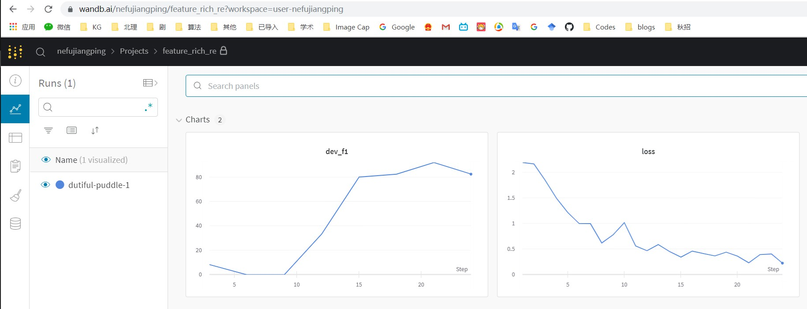

# FeatureRich-RE
----------
# 模型结构参考论文 [A Frustratingly Easy Approach for Joint Entity and Relation Extraction](https://arxiv.org/abs/2010.12812)

# 环境配置
- [wandb](https://pypi.org/project/wandb/): 记录 loss/F1 的日志工具
- [pytroch](https://pytorch.org/): 深度学习模型框架
- [transformers](https://github.com/huggingface/transformers): 预训练模型
- numpy, scikit-learn, tqdm

# 准备数据
## 配置实体类型，关系类型
- 实体类型：`./meta/entity_types`，保证与使用的训练数据一致
- 关系类型：`./meta/rel2id.json`，保证与使用的训练数据一致

## 数据预处理
将自己的数据集转化为模型需要的数据格式，数据格式见 `./data/train.json`，每个样本：
```json
{
    # tokens 列表
    "tokens": ["MORPA", "is", "a", "fully", "implemented", "parser", "developed", "for", "a", "text-to-speech", "system", "."],
    # 实体列表    
    "entities": [
      {
        "entity_type": "Method",  # 实体类型，保证和 ./meta/entity_types.json 列出的一致
        "name": "MORPA",
        "pos": [
          0,  # 实体起始index（包含）
          1  # 实体结束index（不包含）
        ]
      },
      {
        "entity_type": "Method",
        "name": "parser",
        "pos": [
          5,
          6
        ]
      },
      ...
    ],
    # 句子含有的关系列表
    "relations": [
      {
        "h_idx": 0,  # 头实体在实体列表中的index
        "t_idx": 1,  # 尾实体在实体列表中的index
        "r": "Hyponym-Of"    # 关系类型，保证和 ./meta/rel2id.json 列出的一致
      },
      ...
    ],
    "id": "1"  # 每个句子赋予一个ID，便于计算F1指标
}
```

# 下载 sciBERT 预训练模型
参考：./sciBERT/README.md

#  设置参数，运行模型

- 训练模型 `scripts/train_*`，模型读取 `--train_file` 训练，并在训练每一轮结束后在 `--dev_file` 上测试并输出各指标分数，保存在验证集上效果最好的模型到 `--save_path`
```shell script
CUDA_VISIBLE_DEVICES=0 python main.py \
--data_dir ./data \
--meta_dir ./meta \
--transformer_type bert \
--model_name_or_path ./sciBERT \
--train_file train.json \
--dev_file dev.json \
--test_file test.json \
--train_batch_size 16 \
--test_batch_size 16 \
--max_seq_length 50 \
--num_labels 8 \
--learning_rate 2e-5 \
--max_grad_norm 1.0 \
--warmup_ratio 0.06 \
--num_train_epochs 8 \
--mode train \
--save_path checkpoint/FeatureRich-RE-donot-use-entity-type.pt
```

- 验证模型效果 `scripts/eval_*`，模型读取 `--dev_file` 预测并输出分数，给定训练好的模型文件 `--load_path`
```shell script
CUDA_VISIBLE_DEVICES=0 python main.py \
--data_dir ./data \
--meta_dir ./meta \
--transformer_type bert \
--model_name_or_path ./sciBERT \
--dev_file test.json \
--test_batch_size 16 \
--max_seq_length 50 \
--num_labels 8 \
--learning_rate 2e-5 \
--max_grad_norm 1.0 \
--warmup_ratio 0.06 \
--num_train_epochs 8 \
--mode dev \
--load_path checkpoint/FeatureRich-RE-baseline.pt
```

- 模型仅做预测，不输出指标（针对没有关系标注数据做预测） `scripts/pred_`，，给定训练好的模型文件 `--load_path`，模型读取 `--test_file` 做预测，结果输出到与 `--test_file` 相同的目录下，在文件名后加 `_pred` 后缀:
```shell script
CUDA_VISIBLE_DEVICES=0 python main.py \
--data_dir ./data \
--meta_dir ./meta \
--transformer_type bert \
--model_name_or_path ./sciBERT \
--test_file test.json \
--test_batch_size 16 \
--max_seq_length 50 \
--num_labels 8 \
--learning_rate 2e-5 \
--max_grad_norm 1.0 \
--warmup_ratio 0.06 \
--num_train_epochs 8 \
--mode test \
--load_path checkpoint/FeatureRich-RE-baseline.pt
```

## 一些说明
- 训练批次大小（train_batch_size）、学习率（learning_rate）、训练轮数（num_train_epochs）对实验结果影响较大，需要根据实验结果手动调整
- wandb 实验记录工具的使用: 这个工具可以将实验记录保存到本地，并上传到wandb服务器，可以在网页上查看一些试验记录
    + 这次关系抽取模型，使用wandb记录了 dev的F1和训练loss
    + 首先在官网注册，并获取自己的 [API Key](https://docs.wandb.ai/quickstart)，将 API key 复制到 `./main.py 19行` 对应位置
    + 每次实验结束后，可根据提示执行命令 `wandb sync /path/to/FeatureRich-RE/wandb/offline-run-20210514_xxxxx`，将实验记录同步到wandb。114服务器先登录才能正常联网：weblogin 学号 密码
    + 然后可直接在 wandb 网页端查看实验 dev-F1 和 train-loss:
    + 


